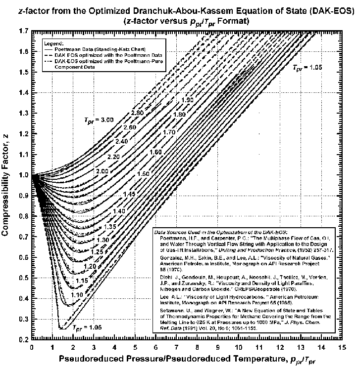
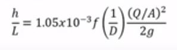
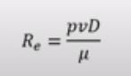
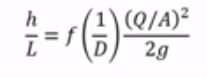
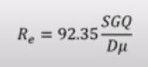
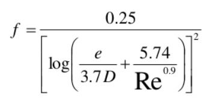

### File 1: Hall and Yarborough Correlation

天然气压缩因子Z求解

### File 2: Frictional Pressure Loss in Pipelines 

使用Swamee-Jain 公式(1976)以雷诺数为基础计算摩擦系数，计算单相流管道中的摩擦压力损失

计算摩擦压力损失的基本方程为：

  

对于石油和天然气工程，方程可修改为：

  

### File 3: Casing Seat Selection

钻井工程领域中的套管座选择问题。在eaton曲线中使用了numpy.interp来计算需要放置套管的深度。
孔隙压力和破裂压力数据在data文件夹中。 
